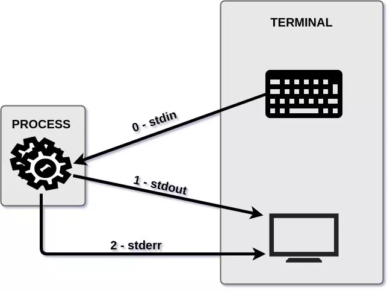

# Introduction to Git & Bash

## Overview

Git (/ɡɪt/) is a distributed version-control system for tracking changes in source code during software development. It is designed for coordinating work among programmers, but it can be used to track changes in any set of files. Its goals include speed, data integrity, and support for distributed, non-linear workflows.

Git was created by Linus Torvalds in 2005 for development of the Linux kernel, with other kernel developers contributing to its initial development. Its current maintainer since 2005 is Junio Hamano. As with most other distributed version-control systems, and unlike most client–server systems, every Git directory on every computer is a full-fledged repository with complete history and full version-tracking abilities, independent of network access or a central server. Git is free and open-source software distributed under the terms of the GNU General Public License version 2.

GNU Bash or simply Bash is a Unix shell and command language written by Brian Fox for the GNU Project as a free software replacement for the Bourne shell. First released in 1989, it has been used widely as the default login shell for most Linux distributions and Apple's macOS Mojave and earlier versions. A version is also available for Windows 10. It is also the default user shell in Solaris 11.

Bash is a command processor that typically runs in a text window where the user types commands that cause actions. Bash can also read and execute commands from a file, called a shell script. Like all Unix shells, it supports filename globbing (wildcard matching), piping, here documents, command substitution, variables, and control structures for condition-testing and iteration. The keywords, syntax, dynamically scoped variables and other basic features of the language are all copied from sh. Other features, e.g., history, are copied from csh and ksh. Bash is a POSIX-compliant shell, but with a number of extensions.

The shell's name is an acronym for Bourne-again shell, a pun on the name of the Bourne shell that it replaces and on the common term "born again".

## Bash Introduction

### Common Commands

The following table contains important `Git Bash` commands to know:

| Command | Description |
| ------- | ----------- |
| `cd` | Change Directory |
| `mkdir` | Make Directory |
| `rmdir` | Remove Directory |
| `mv` | Move or Rename File or Directory |
| `rm` | Remove (Delete) File or Directory |
| `ls` | List Directory |
| `pwd` | Print Working (Current) Directory |
| `less` | Complex pager |
| `find` | Find files matching criteria in Directory |
| `grep` | Global RegEx parser to find patterns in files |
| `head` | Display 1st 10 lines of file |
| `tail` | Display last 10 lines of file |
| `echo` | Send output to the console |
| `cat` | Output contents of file to console (or concatenate files) |
| `vim` | Common `vi` improved editor |
| `file` | Identify type of file |
| `tar` | File archiver |
| `unzip` | Uncompress ZIP file |
| `diff` | Perform difference comparison between files |
| `date` | Get the current date/time |
| `df` | Return free disk space |
| `cp` | Copy Files or Directories |
| `kill` | Kill a running process |
| `ps` | List running processes |
| `touch` | Update date/timestamp on a file |
| `ssh` | Start a secure shell to connect to remote system |
| `nl` | Add line #'s to output stream |
| `env` | List the shells environment variables |


**NOTE:**: All commands takes optional parameters passed using `-` flags. To determine the available options for a command issue the command with the `--help` option. For example to get help on the `ls` command use the `ls --help` option.

### Bash Features

* I/O Redirection
    * Three (3) standard streams:
        * **`stdout`** - Standard Output
        * **`stdin`** - Standard Input
        * **`stderr`** - Standard Error
    * Every command usually reads from standard input and outputs to standard output.
    * Redirect output with "`>`" to send standard output to file.
    * Redirect input with "`<`" to read from file instead of standard input.
    * See https://www.putorius.net/linux-io-file-descriptors-and-redirection.html for a good explanation of I/O redirection and pipes.
    <center></center>
* Pipes
    * Pipes allow output of one command to be sent to input of another command.
    * This feature allows several small utilities to be used to construct complex features.
        * For example a script could find all files of a certain type, looking for a pattern in each file, and printing those which contain the pattern.
    * The `|` character is used to pipe data between commands.
* Aliases
    * Aliases allow the user to define shortcuts to a set of commands.
    * Aliases can use redirection and pipes.
* Functions
    * Shell scripts can use Bash functions.
    * Functions can take parameters and return values.
* Environment Variables
    * The shell keeps an environment of variables which are passed to every command which is launched from the shell.
        * This allows the command to retreive the variables values and use them.

## Git Introduction

From Wikipedia:

Git (/ɡɪt/) is a distributed version-control system for tracking changes in source code during software development. It is designed for coordinating work among programmers, but it can be used to track changes in any set of files. Its goals include speed, data integrity, and support for distributed, non-linear workflows.

### Concepts

* Repositories
    * A Git repository is the `.git/` folder inside a project. This repository tracks all changes made to files in your project, building a history over time. Meaning, if you delete the `.git/` folder, then you delete your project’s history.
* Remotes
    * A remote in Git is a common repository that all team members use to exchange their changes. In most cases, such a remote repository is stored on a code hosting service like GitHub or on an internal server. In contrast to a local repository, a remote typically does not provide a file tree of the project's current state. Instead, it only consists of the .git versioning data.
* Branches
    * Branching is a feature available in most modern version control systems. Branching in other VCS's can be an expensive operation in both time and disk space. In Git, branches are a part of your everyday development process. Git branches are effectively a pointer to a snapshot of your changes. When you want to add a new feature or fix a bug—no matter how big or how small—you spawn a new branch to encapsulate your changes. This makes it harder for unstable code to get merged into the main code base, and it gives you the chance to clean up your future's history before merging it into the main branch.
* Aliases
    * Alias creation is a common pattern found in other popular utilities like `bash` shell. Aliases are used to create shorter commands that map to longer commands. Aliases enable more efficient workflows by requiring fewer keystrokes to execute a command. For a brief example, consider the `git checkout` command. The checkout command is a frequently used git command, which adds up in cumulative keystrokes over time. An alias can be created that maps `git co` to `git checkout`, which saves precious human fingertip power by allowing the shorter keystroke form: `git co` to be typed instead.

### Common Git Commands

#### Getting Help
Git for Windows will pop-up a web browser when using the help facility. If you want help for any git command type "`git <command> --help`" and the commands manual page will be displayed in your web browser.

For instance:
```
$> git clone --help
GIT-CLONE(1)                          Git Manual                         GIT-CLONE(1)

NAME
       git-clone - Clone a repository into a new directory

SYNOPSIS
       git clone [--template=<template_directory>]
                 [-l] [-s] [--no-hardlinks] [-q] [-n] [--bare] [--mirror]
                 [-o <name>] [-b <name>] [-u <upload-pack>] [--reference <repository>]
                 [--dissociate] [--separate-git-dir <git dir>]
                 [--depth <depth>] [--[no-]single-branch] [--no-tags]
                 [--recurse-submodules[=<pathspec>]] [--[no-]shallow-submodules]
                 [--jobs <n>] [--] <repository> [<directory>]
.
.
.
```

#### Command Summary
| Command | Description |
| ------- | ----------- |
| `git clone` | Used to clone repository from the remote server. |
| `git stat` | Used to display the status of the local repository |
| `git pull` | Used to refresh local repository with changes from remote |
| `git add` | Used to add files to the `staging` file list |
| `git push` | Used to push local repository commits to the remote repository |
| `git log` | Used to list commit log |

### Workflow

Typical `git` workflow:

1) Check out repository from GitHub.
    * `git clone git@github.com:michael-uman/intro-to-git.git`
2) Make modifications to files in repository.
    * Modify this *readme* file.
3) Add changed files to staging area.
    * `git add readme.md`
4) Commit staged changes.
    * `git commit`
    * Enter a commit message and save it
5) Push committed changes to remote repository on GitHub.
    * `git push origin master`
6) List all commits
    * `git log`
7) Create a new local branch
    * `git checkout -b <branchname>`

### Handy Git Aliases

Here are some aliases which make git easier to use.

```
hist = log --color --graph --pretty=format:'%C(green)%h%Creset -%C(yellow)%d%Creset %s %Cgreen(%cD) %C(bold blue)<%an>%Creset' --abbrev-commit
br = branch
co = checkout
st = status
```

Here is an example of the use of the `git hist` alias:
```
$> git hist
* 53644d7 - (HEAD -> master) Added section on git commands (Fri, 13 Dec 2019 14:03:30 -0800) <Michael Uman>
* 79e19fc - (origin/master) Initial commit (Tue, 26 Nov 2019 16:57:49 -0800) <Michael Uman>
$>
```
